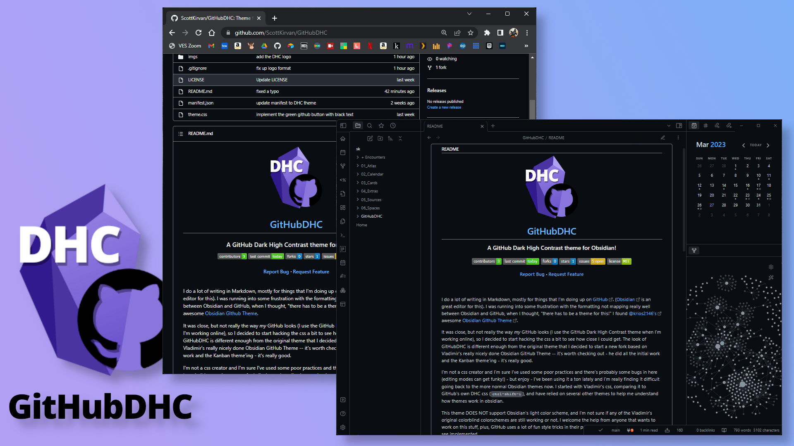

# [GitHubDHC](https://github.com/ScottKirvan/GitHubDHC) - An Obsidian GitHub Style Theme
I do a lot of writing in Markdown, mostly for things that I'm doing up on [GitHub](https://github.com/) ([Obsidian](https://obsidian.md/) is an awesome editor for this).  I was running into some frustration with the formatting not mapping really well between Obsidian and GitHub, when I thought, "there has to be a theme for this!"  I found [@krios2146's](https://github.com/krios2146) [Obsidian GIthub Theme](https://github.com/krios2146/obsidian-theme-github).  

It was close, but not really the way *my* GitHub looks (I use the GitHub Dark High Contrast theme when I'm working online), so I decided to start hacking the css a bit to see how close I could get.  The look of GitHubDHC is different enough from the original theme that I decided to start a new fork based on Vladimir's really nicely done Obsidian GitHub Theme -- it's worth checking out - he did all the initial work and the Kanban theme'ing - it's really good.  

I'm not a css author and I'm sure I've used some poor practices and there's probably some bugs in here (editing modes can get funky!) - but enjoy - I've been using it a ton lately and I'm really finding it difficult going back to the more normal Obsidian themes now.  I started with Vladimir's css and have relied on several other themes to help me understand how things work, as well as digging into GitHub's DHC css to understand what they were doing.

This theme DOES NOT support Obsidian's light color scheme, and I'm not sure if any of the Vladimir's original colorblind colorschemes are still working or not -- I may have broken that functionality.  I welcome the help from anyone that wants to work on this stuff, plus, GitHub uses a lot of fun style tricks in their page rendering that would be fun to see implemented.

## Features
 - [Kanban](https://github.com/mgmeyers/obsidian-kanban) board has been styled to look like a GitHub Projects
 - Callouts in GitHub style
 - Inline code blocks in GitHub style
 - Obsidian UI buttons in GitHub style

## Theme Settings
Theme settings can be found in the [Style Settings](https://github.com/mgmeyers/obsidian-style-settings) plugin.

Current settings include:
- Header colors
- On/Off kanban styles
- On/Off callout styles
- Colorblind colorscheme variants

## How to Install
I hope to have it available soon on the Obsidian theme store.

### Manual Install
1.  Download this repo
2.  Copy the `theme.css` file into your vault's `/.obsidian/themes` directory
3.  Rename the file to `GitHubDHC.css` so it will have a unique name in the theme selection dropdown
4.  Open the **Settings** in Obsidian
5.  Navigate to **Appearances** tab under **Options**
6.  Under the **Themes** section, click on the dropdown menu next to **Theme** heading
7.  Select `Things` and then you're done! 

## Contributing
For any bugs or ideas for new features, please submit a [New Issue](https://github.com/ScottKirvan/GitHubDHC/issues) .  The best way to contribute directly is to make the changes yourself and submit them as a [New Pull Request](https://github.com/ScottKirvan/GitHubDHC/pulls).  Thank you!

## Credits
A huge thank you and all creds due to  [@krios2146](https://github.com/krios2146) and his [Obsidian GitHub Theme](https://github.com/krios2146/obsidian-theme-github).

Vladimir Kidyaev (2022-2023)  
Scott Kirvan (2023-?)  

## Support
Feel free to reach out to me on the [Obsidian Members Group (OMG)](https://discord.gg/obsidianmd) Discord server - I'm @cptvideo

